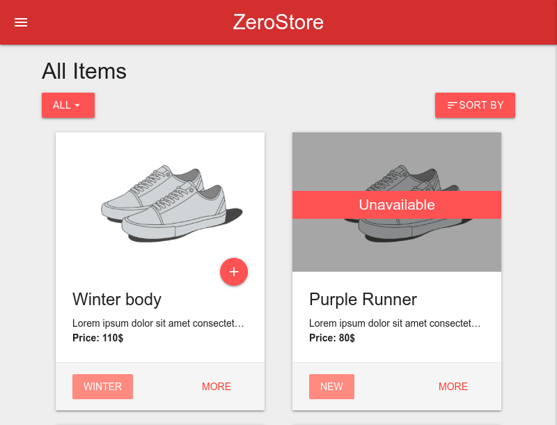
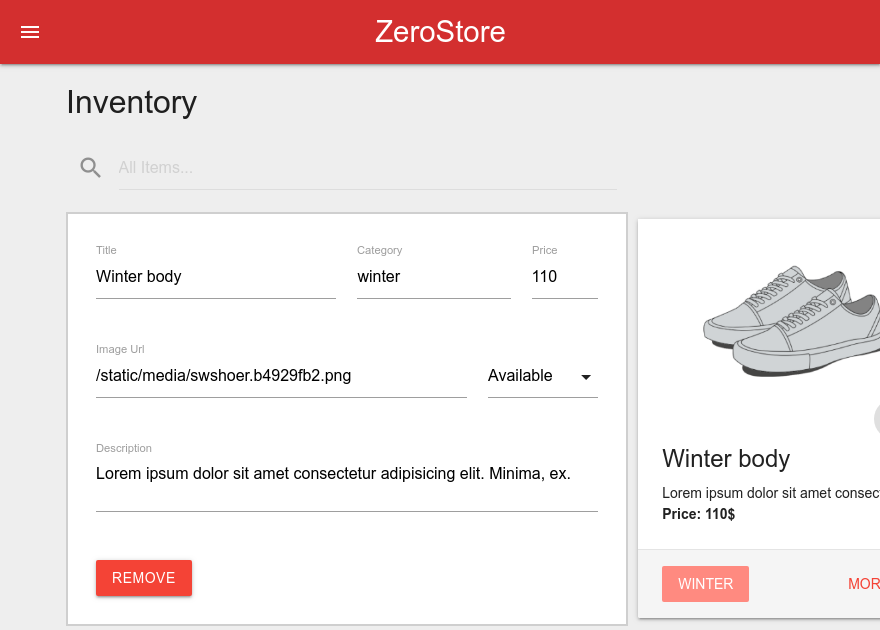

## ZeroStore

#### A simple web store built with functional react and redux
### Homepage

### Inventory

### [View Live](https://zerostore.netlify.com)

### yarn start

Runs the app in the development mode.

### yarn test

Launches the test runner.

### yarn build

Builds the app for production.
